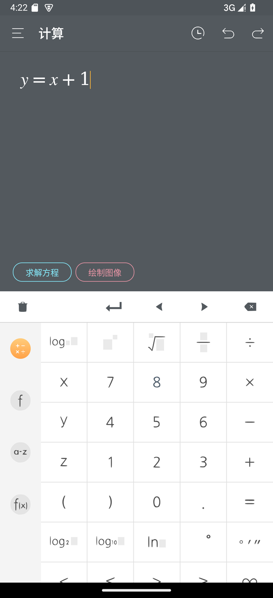
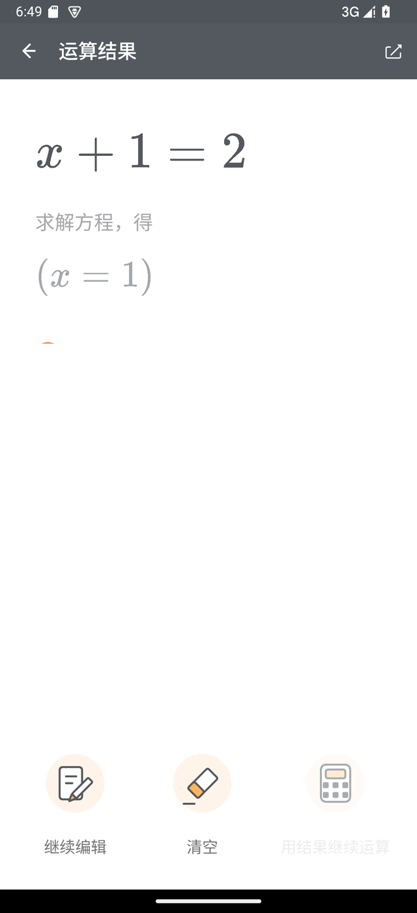
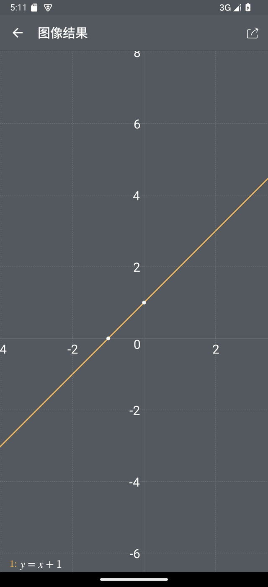
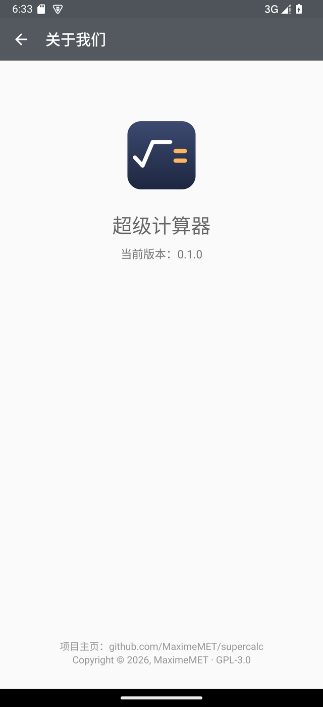

# SuperCalculator

一个用现代 Android 重写的「超级计算器」。

输入框里打什么它都接得住：写一个方程，它给你「求解方程」；写一个高次多项式，它给你
「因式分解」和「多项式展开」；写一个函数，它给你「求导」「积分」「绘制图像」。
边打边算，精确解和数值解同时给。

复刻对象是 2017 年发布、2019 年后就停止维护的有道超级计算器（targetSdk 停在 22，
Android 14 起连安装都会被系统拒绝）。目标是**功能与输出对齐原版**，但代码、素材、品牌
全部重新实现——原版只作为**行为规格**使用，不是代码来源。

> 本项目与网易有道无任何关联，也不包含有道的任何代码、图片或品牌素材。

| 计算 | 运算结果 | 函数图像 | 关于 |
|---|---|---|---|
|  |  |  |  |

截图来自本仓库构建出来的 APK（模拟器 1280×2800 @480dpi），不是原版截图。

> **命名说明**：仓库名用完整的 `SuperCalculator`；Android 包名
> （`io.github.maximemet.supercalc`）、主题名、WebView 页面标题、JS 全局量这类
> **内部标识符一律沿用 `supercalc`**，是有意保留的，不是漏改。

## 功能

### 计算

- **自动判断你想干什么**。输入 `x^2-1` 浮出「因式分解」「多项式展开」，输入 `y=x^2`
  浮出「绘制图像」，输入 `2x+3>7` 浮出「解不等式」，输入多行方程组浮出「求解方程组」。
- **精确解 + 数值解**。`1/3` 同时给出 `= 1/3= 0.3333333333`，`x^2==2` 给出
  `x= \sqrt{2}= 1.4142135624`。
- **符号计算**：求导、不定积分、定积分、多项式展开、因式分解、解方程、解方程组、
  解不等式、解不等式组、求极限、数值化。
- **算不完不会卡死**：超过 5 秒没算完会提示「当前运算较复杂」，并多给一个
  「继续计算」按钮。

### 键盘与编辑

- 四页键盘：基本 / 函数 / 变量 / 公式，左侧书签直接跳页，整条键盘可以左右滑。
- 公式编辑器用的是 MathQuill：真分数、根号、积分号、上下标、矩阵、大括号都是**排**出来的，
  不是贴图。
- 工具行：清空 / 换行 / 左移 / 右移 / 退格；配合撤销、重做。
- 输入过程中不会弹系统输入法——键盘就是唯一的输入方式。

### 结果页

- 结果用 MathJax 排版。
- **解决过程**：解方程 / 方程组 / 不等式（组）、求导 / 极限 / 不定积分都会附上解题步骤
  （移项、系数化 1、判别式、因式分解、求根公式、配方法、消元、穿线法；和差/乘积/商/
  链式法则；等价无穷小、洛必达、取对数；线性性、基本积分表、第一类换元、分部积分），
  和结果一样**离线**算出来；引用的公式来自四张可热更新的知识表（积分 34 条、
  求导 20 条、等价无穷小 19 条、多项式分解 5 条）。开关在设置页的「过程展示」。
- **纯算式也有过程**：`1/2+1/3` 这类算式右侧有常驻的「过程」按钮，
  会展开通分、合并、约分。
- 「继续编辑」「清空」「用结果继续运算」三个动作，和原版一致。
- 分享：把「运算结果：公式 = 结果」作为文本交给系统里支持分享的应用。

### 函数图像

- 最多同时画三条曲线（橙 / 蓝 / 绿）；多行公式从最后一行往前取，和原版一致。
- 单指拖动、双指缩放、双击（原版什么都不做，这里也一样）。
- 自动标出与坐标轴的交点、函数之间的交点；点一下白点弹坐标气泡。
- 二次曲线额外标出焦点、准线、最值点。
- 左下角图例点一下就能隐藏 / 显示某条曲线。
- 分享：截取图区，拼上项目信息条，再选分享渠道。

### 其它

- **历史记录**：分页浏览、清空、点一条把公式填回编辑器。
- **设置**：字体大小、举例展示、保留小数位、过程展示。
- **检查更新**（手动触发）：一次检查同时看应用本体和规则包——应用有新版本就提示你去
  Releases 下载；规则包有新版本就**就地下载、验签、热更新**，不用升级应用。
- **教程 / 关于**：原版抽屉里有的页面都在。

## 联网点只有一处：手动「检查更新」

全 App 只申请两条权限，都只服务设置页里手动点的「检查更新」：`INTERNET`（拉清单、
下安装包和规则包）和 `REQUEST_INSTALL_PACKAGES`（Android 8 起应用内装 APK 的门槛，
首次会由系统问一次）。不点它，一个请求都不会发出去——没有统计、没有广告、没有后台
检查、没有自动更新；分享图片走系统 `FileProvider`，不申请存储权限。断网状态下所有
计算功能照常，和联网时完全一样。

点「检查更新」后只会发生两件事：

1. 拉一次公开仓库的 `updates/manifest.json`（主源 jsDelivr，失败自动退 GitHub raw），
   看应用本体和规则包有没有新版本；
2. 应用有新版本 → 弹出版本号与更新说明，点「去下载新版本」**就在应用内下载**（带进度），
   下完先核对安装包签名和当前应用一致，再交给系统安装器；签名不一致会先警告，
   由你决定装不装。清单里没有直链（老清单）时退回浏览器打开 Releases。
3. 规则包有新版本 → 下载合并包和签名，**ECDSA P-256 / SHA-256 验签通过**后立即生效，
   不用升级应用。验签失败、文件损坏、版本比内置旧，一律回退内置规则包——更新通道
   坏掉不影响计算，也塞不进来路不明的规则。

## 下载与安装

到 [Releases](https://github.com/MaximeMET/SuperCalculator/releases) 下载最新的
`SuperCalculator-<版本>.apk`（文件名带版本号，例如 `SuperCalculator-0.1.1.apk`），
直接安装即可（需要允许安装来自未知来源的应用）。

- 支持 Android 5.0（API 21）到 Android 15（API 35），targetSdk 35；
- 通用包，不含 native 库，arm64 / arm / x86_64 都能装；
- 没有上架任何应用商店，只有 GitHub Release；
- 应用名仍是「超级计算器」，和原版同名是为了界面一致；想区分就改
  `app/src/main/res/values/strings.xml` 里的 `app_name`。

### 怎么第一时间知道新版本

App 只在手动点「检查更新」时才联网，所以「有没有新版」也建议交给外部渠道来盯——
订阅一次，之后自动通知：

- **GitHub 邮件通知**：仓库页点 `Watch` → `Custom` → 只勾 `Releases`；
- **RSS / Atom**：把 <https://github.com/MaximeMET/SuperCalculator/releases.atom>
  丢进任意阅读器（Feedly、Inoreader、FreshRSS 之类）；
- **Obtainium**（安卓）：把仓库地址加进去，它替你盯 Releases，新版直接提示安装；
- 规则包（积分表、求导公式、等价无穷小、多项式公式）不必等 App 发版：设置页「检查更新」里
  就能单独更新，立即生效；订阅 Releases 则用于第一时间拿到应用本体。

APK 用下面这份证书签名，之后的版本也会用同一份，可以用它校验安装包：

```
CN=MaximeMET, OU=SuperCalculator, O=MaximeMET, L=Shanghai, ST=Shanghai, C=CN
SHA-256: 5B:53:7C:56:DC:23:A6:EF:CE:07:CD:7D:50:D2:DC:05:16:E1:A8:F7:C7:68:9A:CE:46:8D:1C:51:46:7F:F3:56
```

## 构建

需要 JDK 17 和 Android SDK（`compileSdk 35`、`build-tools 35`）。SDK 路径写进
`local.properties` 的 `sdk.dir=`，这个文件不进仓库。

```bash
./gradlew :engine:test                # 引擎单元测试（纯 JVM，不需要 Android SDK）
./gradlew :app:testDebugUnitTest      # app 单元测试
./gradlew :app:assembleDebug          # 打 debug 包
./gradlew :app:installDebug           # 装到已连接的设备 / 模拟器
```

Windows 上把 `./gradlew` 换成 `gradlew.bat`。首次运行会去 services.gradle.org
下载 Gradle 8.11.1（wrapper 里带 SHA-256 校验）。

仓库里挂了一个指向私有工作区的 submodule（`work/`，放的是参考包、比对证据这类
不公开的东西）。它不参与构建，普通 `git clone` 即可；只有加了 `--recurse-submodules`
才会因为没权限而报一次错，忽略就行。

`:app:assembleRelease` 需要仓库根目录的 `keystore.properties` 才会出签名包，
没有这个文件时构建 unsigned 包——不配密钥也能编译，细节见
[开发笔记](docs/DEVELOPMENT.md#发布签名)。

## 项目结构

```
engine/   纯 JVM 数学引擎，不依赖 Android，可独立测试
  └ resources/rules/   知识规则包（基本积分表、求导公式表、等价无穷小表、多项式公式表）：加公式只动 JSON，不用改 Kotlin
app/      Android 应用（Kotlin + 原生 View）
tools/    素材生成与组件重建脚本（改素材时才用）
docs/     截图与开发笔记
```

用到的技术：

| 层 | 用什么 |
|---|---|
| 界面 | Kotlin + AndroidX + 原生 View |
| 公式编辑 | MathQuill（跑在 WebView 里，打了两处补丁） |
| 结果排版 | MathJax 3.2.2（离线打包，不联网） |
| 数学引擎 | Symja 2016-04-15（GPL-3.0，打了 4 处补丁） |
| 数学字体 | STIX Two Math（SIL OFL-1.1） |

## 复刻程度

不靠感觉，靠差分测试：给参考包插一个探针，让**原版自己**算出期望值，再拿同一份
1140 条语料跑本项目的引擎，逐字符比。

| 项目 | 一致 |
|---|---|
| 自动预览结果 | 1140 / 1140 |
| 方法按钮集合 | 1131 / 1131 |
| 方法计算结果 | 1229 / 1239（99.2%） |
| 绘图公式 | 69 / 69 |

界面同样是对着实机截图逐像素比的：历史页、设置页、键盘在 1280×2800 @480dpi 下
只剩状态栏时钟和图标边缘抗锯齿的差别；函数图像页的网格、刻度、曲线、准线
与参考实现落在同一像素位置（全屏差异 0.03%）。

剩下的 10 条引擎差异（积分 3、多项式分解 3、求导 3、求解方程 1）都是原版私有分支
里的排版 / 分支选择怪癖，逐条记在[开发笔记](docs/DEVELOPMENT.md#语料库与一致率1140-条)里。

## 已知差异与不做的事

- **「超级 24 点」已删除**：原版抽屉里的那个小游戏不在复刻范围，相关入口、图标、
  字符串和历史类型号一并去掉。
- **依赖网易服务端的功能不可用**：意见反馈、历史上传。这些服务早已下线，开源版不接
  任何服务端；「过程展示」改成纯离线算，「检查更新」改成手动拉一次公开清单。
- **素材全部自有**：键盘图标由开源字体（Noto Sans SC）生成，结果页与工具条图标、
  应用标记、启动图标、分享底图都是本项目自己画的；仓库里没有原版的 382 张位图。
- **数学字体换成 STIX Two Math**：原版用的 Symbola 不允许再分发（详见
  [NOTICE.md](NOTICE.md)），换成了 IEEE 主导、SIL OFL-1.1 发布的 STIX Two Math，
  编辑器里用得到的 245 个码位覆盖率与原版打平（243 / 243）。
- **反馈入口换成了 GitHub**：设置页那句 QQ 群号换成了提 issue 的提示。
- **不联网拉题库**：解题靠 CAS 算法，不是查表；能数据化的表驱动知识（基本积分表、
  求导公式表、等价无穷小表、多项式公式表）内置成 JSON 规则包随包分发，计算全程离线。
  联网只发生在设置页手动点「检查更新」时（见上）。

## 许可

[GPL-3.0](LICENSE)。这不是随便选的：引擎依赖的 Symja 是 GPL-3.0，链接它就决定了
整个项目必须是 GPL-3.0。

### 第三方组件

| 组件 | 许可证 | 用途 |
|---|---|---|
| [Symja](https://github.com/axkr/symja_android_library) | GPL-3.0 | 符号计算内核（含 Rubi 积分规则、JAS 代数系统、Apfloat 高精度浮点） |
| [Hipparchus](https://hipparchus.org/) | Apache-2.0 | 数值方法 |
| [MathQuill](https://github.com/mathquill/mathquill) | MPL-2.0 | 公式编辑器 |
| [jQuery](https://jquery.com/) 2.1.4 | MIT | MathQuill 的运行时依赖 |
| [MathJax](https://www.mathjax.org/) 3.2.2 | Apache-2.0 | 结果页公式排版 |
| [STIX Two Math](https://github.com/stipub/stixfonts) | SIL OFL-1.1 | 编辑器数学字体 |
| [TeX Gyre Termes](https://www.ctan.org/pkg/tex-gyre-termes) | GUST Font License | 编辑器里的 `"Times New Roman"` |
| AndroidX（AppCompat / ConstraintLayout） | Apache-2.0 | Android 界面基础库 |

其中 Symja 和 MathQuill 是**修改版**，两条许可证都要求说明源码怎么拿：

```powershell
pwsh tools/build-symja.ps1        # 拉上游 version_2016-04-15 源码 + 本仓库补丁，重建 jar
pwsh tools/build-mathquill.ps1    # 拉上游 v0.10.1 源码 + 补丁，重建 mathquill.min.js
```

完整的组件清单、改动内容和许可证原文见 [NOTICE.md](NOTICE.md) 与
[licenses/](licenses/)。

## 与参考实现的关系

原版 `com.youdao.calculator` v2.0.0 只用于三件事：观察交互行为与视觉规格、
提取功能清单与数据模型（历史库 schema、键盘键位表）、通过 logcat 抓取计算输出
作为差分测试的期望值。

本项目不包含、也不分发原版的任何代码、图片、字体或品牌素材。界面图形要么是
本项目自己画的（`tools/make_result_icons.py`、`tools/make_launcher_icon.py`），
要么由开源字体生成（`tools/make_keyboard_icons.py`，用到的字体只在生成时下载，
不随仓库分发）；字体只从各自的上游发布获取（CTAN、Google Fonts、noto-cjk），
逐项说明见 [NOTICE.md](NOTICE.md)。

## 开发笔记

里程碑记录、逐像素比对的经过、踩过的坑、引擎补丁的来龙去脉，都在
[docs/DEVELOPMENT.md](docs/DEVELOPMENT.md)。
面向使用者的版本变更记在 [CHANGELOG.md](CHANGELOG.md)。
